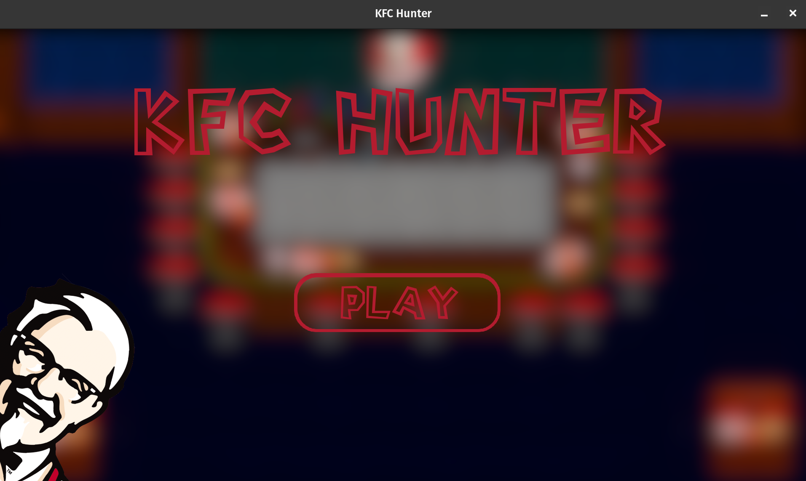
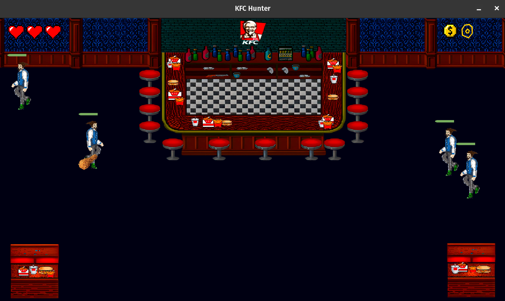

# MY_HUNTER

Another Epitech project

First year Epitech : B1 - Graphical module

This was my first graphical C project with ~~the fantastic~~ CSFML (C graphical Lib)

### Subject

We had to reproduce the "Duck-Hunt" game but with some customization.

I have decided to do a "KFC game". The player have to hit the customer of the restaurant with a tender to feed them before they starve.

To complicate the game I have decided to set a random move of the customers instead of the basic left-to-right move (that was difficult for me because of the collisions)

### Building

* The game require all the [CSFML](https://github.com/SFML/CSFML) lib and the CSFML-dev kit (you can build from source or use the pre-built package provided by your linux distro)
* Clone this repo and enter the directory

  `git clone https://github.com/nicojqn/Epitek1_my_hunter.git && cd Epitek1_my_hunter`
* Build the game

  `make all`
* And then run

  `./my_hunter`

### Use the Release

If you have trouble with CSFML install or to build this game you can use the binary in the release (for linux x_64 only)

### Game Screenshots

